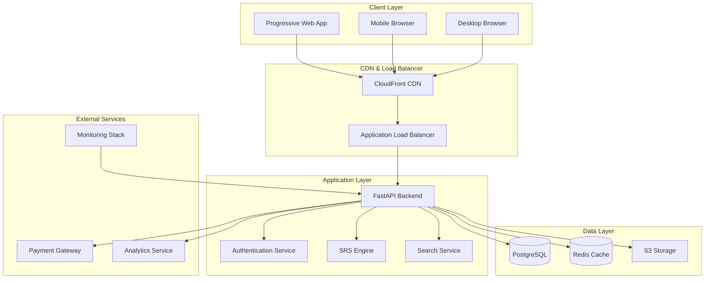
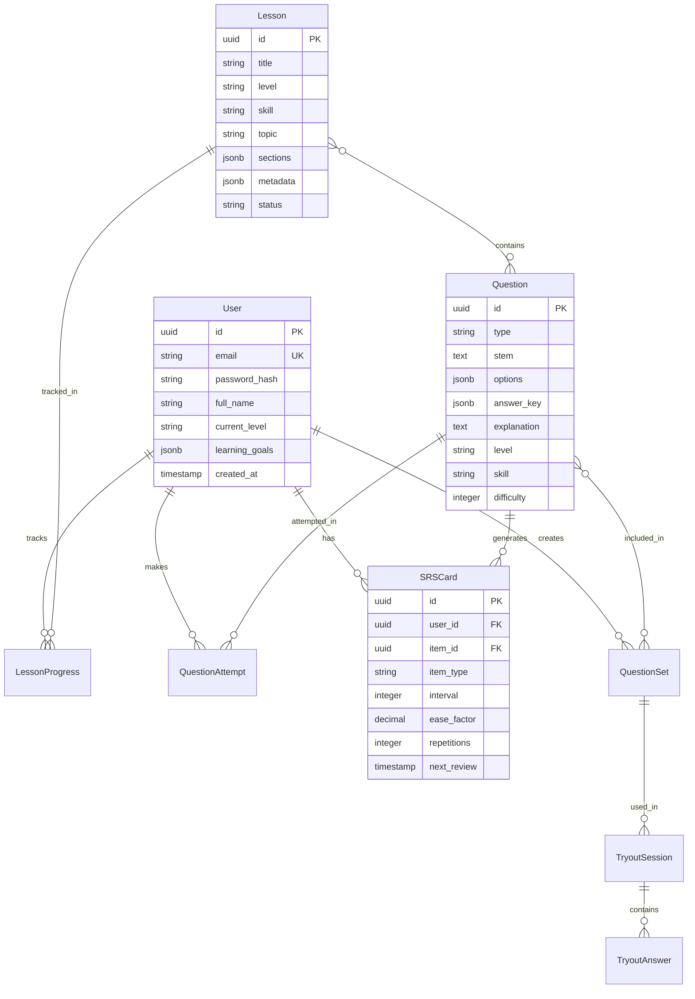

# Design Document

## Overview

The English Learning Platform MVP is designed as a modern, scalable web application that combines interactive digital textbooks with a comprehensive question bank. The system follows a microservices-ready modular monolith architecture, optimized for Indonesian learners with bilingual content delivery and mobile-first experience.

The platform implements a learning-first approach where every concept is immediately followed by practice, supported by an adaptive Spaced Repetition System (SRS) and comprehensive analytics to track learning progress.

## Architecture

### High-Level Architecture



### Technology Stack

**Frontend:**
- Next.js 14+ with React 18
- TypeScript for type safety
- Tailwind CSS for responsive design
- PWA capabilities with service workers
- Offline-first architecture with IndexedDB

**Backend:**
- Python 3.11+ with FastAPI
- Pydantic for data validation
- SQLAlchemy 2.0 with async support
- Alembic for database migrations
- Celery for background tasks

**Database:**
- PostgreSQL 15+ (primary database)
- Redis 7+ (caching and sessions)
- Full-text search with PostgreSQL FTS
- Connection pooling with asyncpg

**Infrastructure:**
- Kubernetes on AWS/GCP
- Docker containers
- Terraform for Infrastructure as Code
- GitHub Actions for CI/CD

## Components and Interfaces

### 1. User Management Component

**Responsibilities:**
- User registration and authentication
- Profile management and preferences
- Role-based access control (RBAC)
- Social login integration

**Key Interfaces:**
```python
class UserService:
    async def register_user(self, user_data: UserCreate) -> User
    async def authenticate_user(self, credentials: UserCredentials) -> AuthToken
    async def update_profile(self, user_id: str, profile_data: ProfileUpdate) -> User
    async def get_user_preferences(self, user_id: str) -> UserPreferences
```

**Database Schema:**
```sql
CREATE TABLE users (
    id UUID PRIMARY KEY DEFAULT gen_random_uuid(),
    email VARCHAR(255) UNIQUE NOT NULL,
    password_hash VARCHAR(255) NOT NULL,
    full_name VARCHAR(255) NOT NULL,
    current_level VARCHAR(10) DEFAULT 'A1',
    learning_goals TEXT[],
    created_at TIMESTAMP DEFAULT NOW(),
    updated_at TIMESTAMP DEFAULT NOW()
);

CREATE TABLE user_preferences (
    user_id UUID REFERENCES users(id),
    language_interface VARCHAR(10) DEFAULT 'id',
    daily_goal INTEGER DEFAULT 3,
    reminder_enabled BOOLEAN DEFAULT true,
    offline_content_enabled BOOLEAN DEFAULT false
);
```

### 2. Content Management Component

**Responsibilities:**
- Lesson and question content storage
- Content versioning and workflow
- Bilingual content management
- Media asset handling

**Key Interfaces:**
```python
class ContentService:
    async def create_lesson(self, lesson_data: LessonCreate) -> Lesson
    async def get_lesson(self, lesson_id: str, user_id: str) -> LessonWithProgress
    async def create_question(self, question_data: QuestionCreate) -> Question
    async def get_questions_by_filters(self, filters: QuestionFilters) -> List[Question]
```

**Database Schema:**
```sql
CREATE TABLE lessons (
    id UUID PRIMARY KEY DEFAULT gen_random_uuid(),
    title VARCHAR(255) NOT NULL,
    level VARCHAR(10) NOT NULL,
    skill VARCHAR(50) NOT NULL,
    topic VARCHAR(100),
    sections JSONB NOT NULL,
    metadata JSONB,
    status VARCHAR(20) DEFAULT 'draft',
    created_at TIMESTAMP DEFAULT NOW()
);

CREATE TABLE questions (
    id UUID PRIMARY KEY DEFAULT gen_random_uuid(),
    type VARCHAR(50) NOT NULL,
    stem TEXT NOT NULL,
    options JSONB,
    answer_key JSONB NOT NULL,
    explanation TEXT,
    level VARCHAR(10) NOT NULL,
    skill VARCHAR(50) NOT NULL,
    topic VARCHAR(100),
    difficulty INTEGER DEFAULT 3,
    metadata JSONB,
    created_at TIMESTAMP DEFAULT NOW()
);
```

### 3. Learning Progress Component

**Responsibilities:**
- Progress tracking across lessons and questions
- Performance analytics and insights
- Achievement and streak management
- Learning path recommendations

**Key Interfaces:**
```python
class ProgressService:
    async def track_lesson_progress(self, user_id: str, lesson_id: str, progress: LessonProgress)
    async def record_question_attempt(self, user_id: str, attempt: QuestionAttempt) -> AttemptResult
    async def get_user_analytics(self, user_id: str) -> UserAnalytics
    async def update_achievements(self, user_id: str) -> List[Achievement]
```

**Database Schema:**
```sql
CREATE TABLE lesson_progress (
    user_id UUID REFERENCES users(id),
    lesson_id UUID REFERENCES lessons(id),
    sections_completed INTEGER DEFAULT 0,
    total_sections INTEGER NOT NULL,
    completion_percentage DECIMAL(5,2) DEFAULT 0,
    time_spent INTEGER DEFAULT 0,
    completed_at TIMESTAMP,
    PRIMARY KEY (user_id, lesson_id)
);

CREATE TABLE question_attempts (
    id UUID PRIMARY KEY DEFAULT gen_random_uuid(),
    user_id UUID REFERENCES users(id),
    question_id UUID REFERENCES questions(id),
    user_answer JSONB NOT NULL,
    is_correct BOOLEAN NOT NULL,
    time_taken INTEGER,
    attempt_number INTEGER DEFAULT 1,
    created_at TIMESTAMP DEFAULT NOW()
);
```

### 4. Spaced Repetition System (SRS) Component

**Responsibilities:**
- SRS algorithm implementation (modified SM-2)
- Review scheduling and queue management
- Difficulty adjustment based on performance
- Learning item lifecycle management

**Key Interfaces:**
```python
class SRSService:
    async def add_to_srs(self, user_id: str, item: SRSItem) -> SRSCard
    async def get_due_reviews(self, user_id: str) -> List[SRSCard]
    async def process_review(self, user_id: str, card_id: str, quality: int) -> SRSCard
    async def get_srs_statistics(self, user_id: str) -> SRSStats
```

**SRS Algorithm Implementation:**
```python
class SRSAlgorithm:
    def calculate_next_interval(self, card: SRSCard, quality: int) -> int:
        """
        Modified SM-2 algorithm optimized for language learning
        quality: 0-5 (0=complete blackout, 5=perfect response)
        """
        if quality < 3:
            # Reset interval for poor performance
            return 1
        
        if card.repetitions == 0:
            interval = 1
        elif card.repetitions == 1:
            interval = 6
        else:
            interval = round(card.interval * card.ease_factor)
        
        # Update ease factor
        ease_factor = card.ease_factor + (0.1 - (5 - quality) * (0.08 + (5 - quality) * 0.02))
        ease_factor = max(1.3, ease_factor)  # Minimum ease factor
        
        return interval, ease_factor
```

### 5. Search and Discovery Component

**Responsibilities:**
- Full-text search across content
- Advanced filtering and faceting
- Search result ranking and relevance
- Performance optimization with caching

**Key Interfaces:**
```python
class SearchService:
    async def search_content(self, query: str, filters: SearchFilters) -> SearchResults
    async def get_popular_content(self, user_id: str) -> List[Content]
    async def get_recommendations(self, user_id: str) -> List[Content]
    async def track_search_analytics(self, query: str, results: SearchResults)
```

**Search Implementation:**
```python
class PostgreSQLSearchService:
    async def search_questions(self, query: str, filters: QuestionFilters) -> List[Question]:
        # Use PostgreSQL FTS with ranking
        search_query = """
        SELECT q.*, ts_rank(search_vector, plainto_tsquery($1)) as rank
        FROM questions q
        WHERE search_vector @@ plainto_tsquery($1)
        AND ($2::varchar IS NULL OR level = $2)
        AND ($3::varchar IS NULL OR skill = $3)
        ORDER BY rank DESC, created_at DESC
        LIMIT $4 OFFSET $5
        """
        
        # Implement caching layer
        cache_key = f"search:{hash(query)}:{hash(filters)}"
        cached_result = await self.redis.get(cache_key)
        
        if cached_result:
            return json.loads(cached_result)
        
        results = await self.db.fetch_all(search_query, query, filters.level, filters.skill, filters.limit, filters.offset)
        
        # Cache for 5 minutes
        await self.redis.setex(cache_key, 300, json.dumps(results))
        return results
```

### 6. Assessment and Tryout Component

**Responsibilities:**
- Custom question set creation
- Timed tryout sessions
- Immediate and delayed feedback modes
- Performance scoring and analysis

**Key Interfaces:**
```python
class AssessmentService:
    async def create_question_set(self, user_id: str, set_data: QuestionSetCreate) -> QuestionSet
    async def start_tryout(self, user_id: str, set_id: str, config: TryoutConfig) -> TryoutSession
    async def submit_tryout_answer(self, session_id: str, answer: TryoutAnswer) -> AnswerResult
    async def complete_tryout(self, session_id: str) -> TryoutResults
```

## Data Models

### Core Entity Relationships



### Content Structure Models

**Lesson Content Structure:**
```json
{
  "lesson_id": "L1_SimplePresent",
  "title": "Simple Present Tense",
  "level": "A1",
  "skill": "grammar",
  "sections": [
    {
      "type": "concept",
      "heading": "Rumus Dasar",
      "content": {
        "en": "Subject + Verb (base form) + Object",
        "id": "Subjek + Kata Kerja (bentuk dasar) + Objek"
      },
      "examples": [
        {
          "en": "She plays tennis every day.",
          "id": "Dia bermain tenis setiap hari."
        }
      ]
    },
    {
      "type": "common_errors",
      "items": [
        {
          "wrong": "She play tennis.",
          "correct": "She plays tennis.",
          "explanation": {
            "en": "Add 's' for third person singular",
            "id": "Tambahkan 's' untuk orang ketiga tunggal"
          }
        }
      ]
    }
  ]
}
```

**Question Structure Models:**
```json
{
  "question_id": "Q_GRM_001",
  "type": "mcq",
  "stem": "Choose the correct sentence:",
  "options": [
    {
      "id": "A",
      "text": "He go to school every day.",
      "explanation": {
        "en": "Incorrect: Should be 'goes' for third person singular",
        "id": "Salah: Harus 'goes' untuk orang ketiga tunggal"
      }
    },
    {
      "id": "B", 
      "text": "He goes to school every day.",
      "explanation": {
        "en": "Correct: Uses proper third person singular form",
        "id": "Benar: Menggunakan bentuk orang ketiga tunggal yang tepat"
      }
    }
  ],
  "answer_key": ["B"],
  "metadata": {
    "level": "A1",
    "skill": "grammar",
    "topic": "simple_present",
    "difficulty": 2,
    "estimated_time": 30
  }
}
```

## Error Handling

### Error Classification and Response Strategy

**Client-Side Error Handling:**
```typescript
class ErrorHandler {
  static handleAPIError(error: APIError): UserFriendlyError {
    switch (error.type) {
      case 'VALIDATION_ERROR':
        return {
          message: 'Please check your input and try again',
          action: 'retry',
          severity: 'warning'
        };
      case 'AUTHENTICATION_ERROR':
        return {
          message: 'Please log in to continue',
          action: 'redirect_login',
          severity: 'error'
        };
      case 'NETWORK_ERROR':
        return {
          message: 'Connection issue. Trying offline mode...',
          action: 'offline_fallback',
          severity: 'info'
        };
      default:
        return {
          message: 'Something went wrong. Please try again.',
          action: 'retry',
          severity: 'error'
        };
    }
  }
}
```

**Server-Side Error Handling:**
```python
class APIErrorHandler:
    @staticmethod
    def handle_database_error(error: Exception) -> HTTPException:
        if isinstance(error, IntegrityError):
            return HTTPException(
                status_code=409,
                detail="Resource already exists or constraint violation"
            )
        elif isinstance(error, OperationalError):
            return HTTPException(
                status_code=503,
                detail="Database temporarily unavailable"
            )
        else:
            logger.error(f"Unexpected database error: {error}")
            return HTTPException(
                status_code=500,
                detail="Internal server error"
            )
```

### Offline Error Handling

**Progressive Enhancement Strategy:**
- Core content cached for offline access
- Graceful degradation when features unavailable
- Queue user actions for sync when online
- Clear offline/online status indicators

```typescript
class OfflineManager {
  async handleOfflineAction(action: UserAction): Promise<ActionResult> {
    // Store action in IndexedDB queue
    await this.queueAction(action);
    
    // Provide immediate feedback
    return {
      success: true,
      message: 'Action saved. Will sync when online.',
      queued: true
    };
  }
  
  async syncQueuedActions(): Promise<SyncResult> {
    const queuedActions = await this.getQueuedActions();
    const results = [];
    
    for (const action of queuedActions) {
      try {
        const result = await this.api.executeAction(action);
        results.push(result);
        await this.removeFromQueue(action.id);
      } catch (error) {
        // Keep in queue for retry
        results.push({ error, action });
      }
    }
    
    return { results, remaining: await this.getQueuedActions() };
  }
}
```

## Testing Strategy

### Comprehensive Testing Approach

**Unit Testing (Target: 85% coverage):**
```python
# Example unit test for SRS algorithm
class TestSRSAlgorithm:
    def test_calculate_next_interval_poor_performance(self):
        card = SRSCard(interval=7, ease_factor=2.5, repetitions=3)
        algorithm = SRSAlgorithm()
        
        new_interval, new_ease = algorithm.calculate_next_interval(card, quality=1)
        
        assert new_interval == 1  # Reset to beginning
        assert new_ease < card.ease_factor  # Decrease ease factor
    
    def test_calculate_next_interval_good_performance(self):
        card = SRSCard(interval=7, ease_factor=2.5, repetitions=3)
        algorithm = SRSAlgorithm()
        
        new_interval, new_ease = algorithm.calculate_next_interval(card, quality=5)
        
        assert new_interval > card.interval  # Increase interval
        assert new_ease >= card.ease_factor  # Maintain or increase ease
```

**Integration Testing (Target: 75% coverage):**
```python
class TestLearningFlow:
    async def test_complete_lesson_flow(self):
        # Test complete user journey
        user = await self.create_test_user()
        lesson = await self.create_test_lesson()
        
        # Start lesson
        progress = await self.progress_service.start_lesson(user.id, lesson.id)
        assert progress.completion_percentage == 0
        
        # Complete sections
        for section in lesson.sections:
            await self.progress_service.complete_section(user.id, lesson.id, section.id)
        
        # Verify completion
        final_progress = await self.progress_service.get_progress(user.id, lesson.id)
        assert final_progress.completion_percentage == 100
        
        # Verify SRS items created
        srs_items = await self.srs_service.get_user_items(user.id)
        assert len(srs_items) > 0
```

**End-to-End Testing:**
```typescript
// Playwright E2E test
test('complete learning session', async ({ page }) => {
  await page.goto('/login');
  await page.fill('[data-testid=email]', 'test@example.com');
  await page.fill('[data-testid=password]', 'password');
  await page.click('[data-testid=login-button]');
  
  // Navigate to lesson
  await page.click('[data-testid=lesson-card]');
  
  // Complete lesson sections
  await page.click('[data-testid=start-lesson]');
  await page.click('[data-testid=next-section]');
  await page.click('[data-testid=complete-lesson]');
  
  // Verify progress updated
  await expect(page.locator('[data-testid=progress-bar]')).toHaveAttribute('aria-valuenow', '100');
});
```

**Performance Testing:**
```python
# Load testing with Locust
class UserBehavior(HttpUser):
    wait_time = between(1, 3)
    
    def on_start(self):
        self.login()
    
    @task(3)
    def browse_lessons(self):
        self.client.get("/api/lessons")
    
    @task(2)
    def search_questions(self):
        self.client.get("/api/questions/search?q=grammar&level=A1")
    
    @task(1)
    def complete_question(self):
        response = self.client.get("/api/questions/random")
        question = response.json()
        self.client.post(f"/api/questions/{question['id']}/attempt", json={
            "answer": "A",
            "time_taken": 15
        })
```

This design provides a solid foundation for building a scalable, maintainable English learning platform that meets all the requirements while being optimized for Indonesian learners and mobile-first usage.