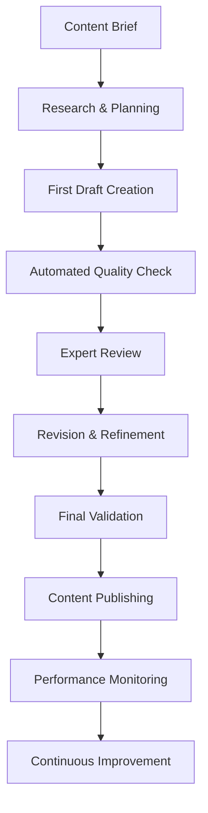

# Content Strategy & Curriculum Design — Bank Soal + Buku Digital Bahasa Inggris
**Tanggal:** 31 Agustus 2025  
**Tim:** Content & Curriculum  
**Status:** Implementation Ready

---

## 1. Pedagogical Framework Validation

### 1.1 Expert Advisory Board
**Composition:**
```json
{
  "linguistics_experts": {
    "count": 2,
    "expertise": "English grammar, second language acquisition",
    "role": "Content accuracy validation, progression logic review"
  },
  "education_specialists": {
    "count": 2, 
    "expertise": "Learning theory, instructional design",
    "role": "Pedagogical approach validation, assessment design"
  },
  "indonesian_teachers": {
    "count": 3,
    "expertise": "Teaching English to Indonesian learners",
    "role": "Cultural context, common error patterns, local needs"
  },
  "test_prep_experts": {
    "count": 2,
    "expertise": "IELTS, TOEFL, TOEIC preparation",
    "role": "Exam alignment, question type validation"
  }
}
```

### 1.2 Curriculum Validation Process
**Phase 1: Theoretical Framework Review**
```markdown
### Learning Theory Application Audit
**Constructivist Learning:**
- Knowledge building through scaffolded experiences
- Prior knowledge activation (Indonesian → English)
- Social learning through community features

**Cognitive Load Theory:**
- Information chunking in lessons (≤ 250 words)
- Progressive complexity introduction
- Multimedia learning principles

**Spaced Repetition Science:**
- Forgetting curve optimization
- Retrieval practice integration
- Long-term retention strategies
```

**Phase 2: Content Progression Logic**
```python
# Curriculum Progression Validator
class CurriculumValidator:
    def validate_progression(self, curriculum):
        checks = {
            'prerequisite_mapping': self.check_prerequisites(curriculum),
            'difficulty_gradient': self.analyze_difficulty_curve(curriculum),
            'skill_integration': self.validate_skill_mixing(curriculum),
            'cultural_progression': self.check_cultural_scaffolding(curriculum)
        }
        return self.generate_validation_report(checks)
    
    def check_prerequisites(self, curriculum):
        # Ensure each lesson builds on previous knowledge
        # Validate grammar concept dependencies
        # Check vocabulary level progression
        pass
```

---

## 2. Indonesian Context Integration

### 2.1 Cultural Localization Framework
**Indonesian Learning Context:**
```json
{
  "cultural_references": {
    "food_examples": ["nasi goreng", "rendang", "gado-gado", "sate"],
    "places": ["Borobudur", "Bali", "Jakarta", "Yogyakarta"],
    "customs": ["Lebaran", "gotong royong", "bapakisme", "jam karet"],
    "daily_life": ["ojek online", "warung", "kost", "angkot"]
  },
  "language_interference_patterns": {
    "grammar": [
      "no plural markers (book vs books)",
      "no tense markers (eat vs ate vs eaten)", 
      "different word order (adjective after noun)",
      "no articles (a, an, the confusion)"
    ],
    "pronunciation": [
      "th sounds → t/d",
      "v sounds → f", 
      "final consonant clusters",
      "stress pattern differences"
    ],
    "vocabulary": [
      "false friends (actual vs aktual)",
      "direct translation errors",
      "formality level confusion"
    ]
  }
}
```

### 2.2 Common Error Database
**Indonesian Learner Error Patterns:**
```markdown
### Grammar Error Categories
**Article Usage:**
- Wrong: "I go to school" → Right: "I go to the school"
- Wrong: "She is teacher" → Right: "She is a teacher"
- Indonesian context: No articles in Bahasa Indonesia

**Tense Confusion:**
- Wrong: "Yesterday I go to mall" → Right: "Yesterday I went to the mall"
- Wrong: "I already eat" → Right: "I have already eaten"
- Indonesian context: Time markers instead of tense inflection

**Preposition Errors:**
- Wrong: "I live in Jakarta since 2020" → Right: "I have lived in Jakarta since 2020"
- Wrong: "Different with" → Right: "Different from"
- Indonesian context: Direct translation from "berbeda dengan"
```

### 2.3 Culturally Relevant Examples
**Example Integration Strategy:**
```python
class CulturalContentGenerator:
    def __init__(self):
        self.indonesian_contexts = {
            'work': ['kantor', 'meeting', 'deadline', 'lembur'],
            'education': ['kampus', 'skripsi', 'dosen', 'UTS'],
            'social': ['arisan', 'bukber', 'mudik', 'kondangan'],
            'technology': ['gojek', 'shopee', 'zoom meeting', 'WFH']
        }
    
    def generate_contextual_examples(self, grammar_point, context):
        # Create examples using Indonesian cultural references
        # Ensure grammatical accuracy while maintaining cultural relevance
        # Balance familiar context with English learning goals
        pass
```

---

## 3. Content Accessibility & Inclusive Design

### 3.1 Universal Design for Learning (UDL)
**Multiple Means of Representation:**
```json
{
  "visual_learners": {
    "infographics": "Grammar rules in visual format",
    "color_coding": "Different colors for parts of speech",
    "mind_maps": "Vocabulary connections and relationships",
    "charts": "Tense timeline visualizations"
  },
  "auditory_learners": {
    "pronunciation_guides": "IPA symbols with audio",
    "rhythm_patterns": "Stress and intonation practice",
    "listening_exercises": "Contextual audio examples",
    "text_to_speech": "All content readable aloud"
  },
  "kinesthetic_learners": {
    "interactive_exercises": "Drag-and-drop grammar building",
    "gesture_based": "Physical movement for memory",
    "hands_on_practice": "Real-world application tasks",
    "gamification": "Achievement-based learning"
  }
}
```

### 3.2 Accessibility Features Implementation
**Technical Accessibility:**
```markdown
### WCAG 2.1 AA Compliance
**Visual Accessibility:**
- High contrast mode (4.5:1 ratio minimum)
- Font size adjustment (up to 200% without horizontal scrolling)
- Dyslexia-friendly fonts (OpenDyslexic option)
- Color-blind friendly palette
- Screen reader compatibility

**Motor Accessibility:**
- Keyboard navigation for all functions
- Voice input for answer submission
- Touch target size minimum 44px
- Gesture alternatives for swipe actions

**Cognitive Accessibility:**
- Simplified UI mode option
- Clear progress indicators
- Consistent navigation patterns
- Error prevention and clear error messages
```

### 3.3 Learning Differences Support
**Adaptive Content Delivery:**
```python
class AdaptiveContentSystem:
    def __init__(self):
        self.learning_profiles = {
            'dyslexia': {
                'font': 'OpenDyslexic',
                'spacing': 'increased_line_height',
                'colors': 'high_contrast_mode',
                'audio': 'text_to_speech_default'
            },
            'adhd': {
                'session_length': 'shorter_chunks',
                'distractions': 'minimal_ui_mode',
                'progress': 'frequent_checkpoints',
                'rewards': 'immediate_feedback'
            },
            'processing_speed': {
                'timing': 'extended_time_limits',
                'complexity': 'simplified_instructions',
                'support': 'hint_system_available',
                'practice': 'additional_repetition'
            }
        }
```

---

## 4. Content Quality Assurance Framework

### 4.1 Multi-Layer Validation Process
**Layer 1: Automated Validation**
```python
class ContentQualityChecker:
    def __init__(self):
        self.validation_rules = {
            'linguistic_accuracy': self.check_grammar_rules,
            'cefr_alignment': self.validate_difficulty_level,
            'cultural_appropriateness': self.check_cultural_sensitivity,
            'pedagogical_soundness': self.validate_learning_objectives
        }
    
    def comprehensive_content_audit(self, content):
        results = {}
        for check_type, validator in self.validation_rules.items():
            results[check_type] = validator(content)
        return self.generate_quality_report(results)
    
    def check_grammar_rules(self, content):
        # Use NLP libraries to validate grammar
        # Check against established English grammar rules
        # Flag potential errors for human review
        pass
```

**Layer 2: Expert Review**
```markdown
### Expert Review Protocol
**Native Speaker Review:**
- Grammar accuracy verification
- Natural language usage check
- Cultural appropriateness assessment
- Pronunciation guide validation

**Indonesian Teacher Review:**
- Common error prediction
- Cultural context relevance
- Learning objective alignment
- Difficulty level appropriateness

**Pedagogical Review:**
- Learning theory application
- Assessment validity
- Progression logic
- Engagement factor analysis
```

### 4.2 Content Effectiveness Measurement
**Learning Outcome Tracking:**
```json
{
  "effectiveness_metrics": {
    "comprehension_rate": "% users who understand concept after lesson",
    "retention_rate": "% users who remember concept after 1 week",
    "application_rate": "% users who can apply concept in new context",
    "transfer_rate": "% users who can use concept in real communication"
  },
  "content_optimization": {
    "a_b_testing": "Different explanation approaches",
    "difficulty_calibration": "Empirical difficulty vs intended",
    "engagement_analysis": "Time spent, completion rates",
    "error_pattern_analysis": "Common mistakes per content piece"
  }
}
```

---

## 5. Curriculum Mapping & Standards Alignment

### 5.1 Indonesian Education Standards
**Kurikulum Merdeka Alignment:**
```markdown
### English Subject Mapping
**SMA Level Alignment:**
- Kelas X: Basic communication, simple tenses (A1-A2)
- Kelas XI: Complex communication, advanced grammar (A2-B1)  
- Kelas XII: Academic English, test preparation (B1-B2)

**University Preparation:**
- Academic writing skills
- Critical reading comprehension
- Presentation and discussion skills
- Research and citation methods
```

### 5.2 International Standards Compliance
**CEFR Framework Integration:**
```python
class CEFRValidator:
    def __init__(self):
        self.cefr_descriptors = {
            'A1': {
                'grammar': ['present simple', 'basic questions', 'articles'],
                'vocabulary': ['numbers', 'family', 'daily routines'],
                'functions': ['introducing self', 'asking for help']
            },
            'A2': {
                'grammar': ['past simple', 'future with going to', 'comparatives'],
                'vocabulary': ['shopping', 'travel', 'health'],
                'functions': ['describing experiences', 'making plans']
            }
            # ... continue for B1, B2, C1, C2
        }
    
    def validate_content_level(self, content, claimed_level):
        # Analyze vocabulary complexity
        # Check grammatical structures used
        # Validate functional language appropriateness
        return self.generate_cefr_compliance_report(content, claimed_level)
```

### 5.3 Test Preparation Alignment
**Major English Tests Coverage:**
```json
{
  "ielts_preparation": {
    "academic_module": "University admission focus",
    "general_module": "Immigration and work focus",
    "skills_coverage": ["reading", "writing", "listening", "speaking"],
    "band_score_targeting": "5.5 to 7.5 range"
  },
  "toefl_preparation": {
    "ibt_format": "Internet-based test focus",
    "skills_integration": "Combined skills tasks",
    "score_targeting": "60 to 100 range",
    "academic_context": "University-level content"
  },
  "toeic_preparation": {
    "business_english": "Workplace communication",
    "listening_reading": "Core skills focus",
    "score_targeting": "600 to 900 range",
    "professional_context": "Office and business scenarios"
  }
}
```

---

## 6. Content Production Workflow

### 6.1 Content Creation Pipeline


### 6.2 Content Templates & Standards
**Lesson Template Structure:**
```markdown
### Standard Lesson Format
**Header Information:**
- Lesson ID, Title, CEFR Level
- Learning objectives (3-5 specific goals)
- Prerequisites and follow-up lessons
- Estimated completion time

**Content Sections:**
1. **Concept Introduction** (≤ 150 words)
   - Clear definition with examples
   - Visual aids where appropriate
   - Connection to prior knowledge

2. **Indonesian Context** (≤ 100 words)
   - Cultural relevance explanation
   - Common interference patterns
   - Local usage examples

3. **Guided Practice** (5-7 exercises)
   - Progressive difficulty increase
   - Immediate feedback provision
   - Error explanation with correction

4. **Free Practice** (3-5 exercises)
   - Real-world application
   - Creative usage opportunities
   - Peer interaction elements

5. **Assessment & Review** (3-5 questions)
   - Mastery check exercises
   - SRS item identification
   - Progress tracking integration
```

---

## 7. Content Localization Strategy

### 7.1 Bilingual Content Approach
**Strategic Bilingual Integration:**
```json
{
  "explanation_language": {
    "grammar_rules": "Indonesian for clarity",
    "cultural_context": "Indonesian for relevance", 
    "error_explanations": "Indonesian for understanding",
    "instructions": "Bilingual with English emphasis"
  },
  "practice_language": {
    "examples": "English with Indonesian translation",
    "exercises": "Primarily English",
    "feedback": "Bilingual for comprehension",
    "assessments": "English with Indonesian support"
  }
}
```

### 7.2 Regional Adaptation
**Indonesian Regional Considerations:**
```markdown
### Regional Language Influences
**Javanese Influence Areas:**
- Formal/informal language distinction emphasis
- Respect level language teaching
- Cultural hierarchy in communication

**Sundanese Influence Areas:**
- Pronunciation pattern considerations
- Local cultural reference integration
- Regional English usage patterns

**Batak/Minang Influence Areas:**
- Direct communication style adaptation
- Cultural value integration in examples
- Regional business context inclusion
```

---

## 8. Success Metrics & Continuous Improvement

### 8.1 Content Performance KPIs
```json
{
  "learning_effectiveness": {
    "concept_mastery_rate": "> 80% users achieve learning objectives",
    "retention_after_week": "> 70% users retain key concepts",
    "application_success": "> 65% users apply concepts correctly",
    "progression_rate": "> 75% users advance to next level"
  },
  "engagement_metrics": {
    "completion_rate": "> 85% users finish lessons",
    "time_on_content": "Optimal range 10-20 minutes per lesson",
    "return_rate": "> 60% users return within 48 hours",
    "content_rating": "> 4.2/5 average user rating"
  }
}
```

### 8.2 Continuous Content Optimization
**Data-Driven Improvement Cycle:**
```python
class ContentOptimizer:
    def analyze_content_performance(self, content_id):
        metrics = {
            'user_engagement': self.get_engagement_data(content_id),
            'learning_outcomes': self.measure_learning_effectiveness(content_id),
            'error_patterns': self.analyze_common_mistakes(content_id),
            'feedback_sentiment': self.process_user_feedback(content_id)
        }
        return self.generate_optimization_recommendations(metrics)
    
    def implement_improvements(self, content_id, recommendations):
        # A/B test different content versions
        # Measure improvement in key metrics
        # Roll out successful optimizations
        # Document lessons learned
        pass
```