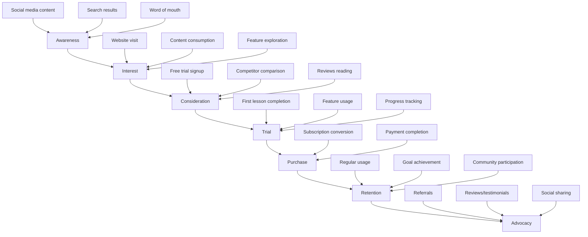

# Go-to-Market Strategy — Bank Soal + Buku Digital Bahasa Inggris
**Tanggal:** 31 Agustus 2025  
**Tim:** Growth & Marketing  
**Status:** Implementation Ready

---

## 1. Market Analysis & Positioning

### 1.1 Indonesian English Learning Market
**Market Size & Opportunity:**
```json
{
  "market_segments": {
    "students": {
      "size": "15M+ SMA & university students",
      "growth_rate": "8% annually",
      "pain_points": ["exam preparation", "grammar confusion", "limited practice"]
    },
    "professionals": {
      "size": "25M+ working professionals",
      "growth_rate": "12% annually", 
      "pain_points": ["career advancement", "workplace communication", "certification"]
    },
    "test_preparation": {
      "size": "500K+ annual test takers",
      "growth_rate": "15% annually",
      "pain_points": ["score improvement", "structured preparation", "expensive courses"]
    }
  },
  "market_trends": {
    "digital_adoption": "85% smartphone penetration",
    "online_learning": "300% growth post-pandemic",
    "english_proficiency": "Low proficiency ranking globally",
    "mobile_first": "90% access via mobile devices"
  }
}
```

### 1.2 Competitive Landscape Analysis
**Direct Competitors:**
```markdown
### Competitor Analysis Matrix
**Duolingo:**
- Strengths: Gamification, brand recognition, free model
- Weaknesses: Shallow content, not Indonesia-specific
- Market share: ~30% of language learning apps
- Differentiation opportunity: Deeper grammar focus, local context

**Cake (Snow):**
- Strengths: Entertainment-based learning, viral content
- Weaknesses: Limited structured curriculum, no assessment
- Market share: ~15% in Indonesia
- Differentiation opportunity: Systematic progression, bank soal

**Local Competitors (English First, Wall Street English):**
- Strengths: Local presence, instructor-led
- Weaknesses: High cost, limited accessibility
- Market share: ~5% combined
- Differentiation opportunity: Affordable, accessible, self-paced
```

### 1.3 Unique Value Proposition
**Core Positioning:**
```markdown
### Value Proposition Canvas
**Customer Jobs:**
- Learn English grammar systematically
- Practice with relevant, challenging questions
- Track progress and identify weaknesses
- Prepare for English proficiency tests

**Pain Relievers:**
- Bilingual explanations (ID/EN) for clarity
- Indonesian learner-specific error patterns
- Comprehensive question bank with detailed explanations
- Adaptive learning based on performance

**Gain Creators:**
- Structured curriculum following proven pedagogy
- Mobile-first design for learning on-the-go
- Affordable pricing compared to traditional courses
- Community features for peer learning
```

---

## 2. Target Customer Segmentation

### 2.1 Primary Personas
**Persona 1: University Student (Andi)**
```json
{
  "demographics": {
    "age": 20,
    "location": "Jakarta",
    "education": "University student",
    "income": "Rp 2-3M/month (part-time + allowance)"
  },
  "goals": {
    "primary": "Pass English proficiency requirements",
    "secondary": "Improve job prospects after graduation"
  },
  "pain_points": [
    "Grammar rules confusing in English-only explanations",
    "Limited budget for expensive courses",
    "Need flexible learning schedule around classes"
  ],
  "preferred_channels": ["Instagram", "TikTok", "WhatsApp groups"],
  "buying_behavior": "Price-sensitive, influenced by peer recommendations"
}
```

**Persona 2: Working Professional (Sari)**
```json
{
  "demographics": {
    "age": 28,
    "location": "Surabaya", 
    "education": "Bachelor's degree",
    "income": "Rp 8-12M/month"
  },
  "goals": {
    "primary": "Career advancement requiring English skills",
    "secondary": "International certification (IELTS/TOEIC)"
  },
  "pain_points": [
    "Limited time for structured learning",
    "Need practical business English skills",
    "Want measurable progress tracking"
  ],
  "preferred_channels": ["LinkedIn", "Professional WhatsApp groups", "Email"],
  "buying_behavior": "Value-focused, willing to pay for quality and convenience"
}
```

### 2.2 Customer Journey Mapping


---

## 3. Go-to-Market Phases

### 3.1 Phase 1: Organic Foundation (Month 1-3)
**Objectives:**
- Build brand awareness in target segments
- Establish thought leadership in English learning
- Generate initial user base through content marketing
- Validate product-market fit with early adopters

**Key Strategies:**
```markdown
### Content Marketing Strategy
**Blog Content (2 posts/week):**
- "10 Grammar Mistakes Indonesian Speakers Make"
- "IELTS Preparation Guide for Indonesian Students"
- "Business English Phrases for Indonesian Professionals"
- "Common English Errors in Indonesian Context"

**Social Media Content:**
- Instagram: Daily grammar tips with visual explanations
- TikTok: Short English learning videos (15-30 seconds)
- YouTube: Weekly lesson previews and study tips
- LinkedIn: Professional English content for working adults

**SEO Strategy:**
- Target keywords: "belajar bahasa inggris", "grammar bahasa inggris", "soal IELTS"
- Long-tail keywords: "cara belajar grammar bahasa inggris untuk pemula"
- Local SEO: "kursus bahasa inggris online Jakarta"
```

**Implementation Timeline:**
```gantt
title Phase 1 Implementation
dateFormat  YYYY-MM-DD
section Content Creation
Blog Setup & Content    :2025-09-01, 30d
Social Media Launch     :2025-09-08, 21d
SEO Optimization       :2025-09-15, 45d
section Community Building
Influencer Outreach    :2025-09-22, 30d
User-Generated Content :2025-10-01, 60d
```

### 3.2 Phase 2: Paid Acquisition (Month 4-6)
**Objectives:**
- Scale user acquisition through paid channels
- Optimize conversion funnels
- Expand market reach beyond organic audience
- Achieve target CAC:LTV ratios

**Paid Marketing Channels:**
```json
{
  "google_ads": {
    "budget_allocation": "40% of paid budget",
    "campaign_types": ["Search", "Display", "YouTube"],
    "target_keywords": ["belajar bahasa inggris", "kursus online", "IELTS preparation"],
    "expected_cac": "Rp 75,000",
    "target_conversion_rate": "8%"
  },
  "facebook_instagram_ads": {
    "budget_allocation": "35% of paid budget", 
    "campaign_types": ["Conversion", "Video views", "Lead generation"],
    "targeting": ["Students 18-25", "Professionals 25-35", "English learners"],
    "expected_cac": "Rp 60,000",
    "target_conversion_rate": "12%"
  },
  "tiktok_ads": {
    "budget_allocation": "15% of paid budget",
    "campaign_types": ["In-feed ads", "Branded hashtag challenge"],
    "targeting": ["Gen Z students", "Young professionals"],
    "expected_cac": "Rp 45,000",
    "target_conversion_rate": "15%"
  },
  "youtube_ads": {
    "budget_allocation": "10% of paid budget",
    "campaign_types": ["Pre-roll", "Discovery ads"],
    "targeting": ["English learning content viewers"],
    "expected_cac": "Rp 90,000",
    "target_conversion_rate": "6%"
  }
}
```

### 3.3 Phase 3: Partnership & Expansion (Month 7-12)
**Objectives:**
- Establish strategic partnerships for user acquisition
- Expand into adjacent markets and user segments
- Build referral and affiliate programs
- Prepare for international expansion

**Partnership Strategy:**
```markdown
### Strategic Partnerships
**Educational Institutions:**
- Universities: Supplementary learning tool for English courses
- High schools: Test preparation support for students
- Language centers: White-label solution or partnership

**Corporate Partnerships:**
- HR departments: Employee English training programs
- Consulting firms: Professional development offerings
- Multinational companies: Internal training tool

**Influencer Partnerships:**
- English teachers: Content collaboration and endorsements
- Study abroad consultants: Test preparation recommendations
- Career coaches: Professional development content
```

---

## 4. Pricing Strategy & Revenue Model

### 4.1 Freemium Model Structure
```json
{
  "free_tier": {
    "features": [
      "3 lessons per day",
      "Basic progress tracking", 
      "Community forum access",
      "Limited question bank access (50 questions/day)"
    ],
    "limitations": [
      "No offline access",
      "Basic analytics only",
      "No custom study plans",
      "Ads supported"
    ],
    "conversion_goal": "15% to paid within 30 days"
  },
  "pro_tier": {
    "price": "Rp 49,000/month or Rp 490,000/year",
    "features": [
      "Unlimited lessons and questions",
      "Offline download capability",
      "Advanced progress analytics",
      "Custom study plans",
      "Priority customer support",
      "Ad-free experience",
      "Export progress reports"
    ],
    "target_market": "Individual learners seeking comprehensive features"
  },
  "premium_tier": {
    "price": "Rp 99,000/month or Rp 990,000/year",
    "features": [
      "All Pro features",
      "1-on-1 monthly coaching session",
      "Personalized learning path",
      "Advanced AI recommendations",
      "Priority feature requests",
      "Beta feature access"
    ],
    "target_market": "Serious learners and test preparation students"
  }
}
```

### 4.2 Pricing Validation & Testing
**A/B Testing Framework:**
```python
class PricingExperiment:
    def __init__(self):
        self.test_variants = {
            'control': {'monthly': 49000, 'annual': 490000},
            'variant_a': {'monthly': 39000, 'annual': 390000},  # Lower price
            'variant_b': {'monthly': 59000, 'annual': 590000},  # Higher price
            'variant_c': {'monthly': 49000, 'annual': 440000}   # Annual discount
        }
        
    def measure_conversion_impact(self, variant):
        metrics = {
            'signup_to_trial_rate': self.get_trial_conversion(variant),
            'trial_to_paid_rate': self.get_paid_conversion(variant),
            'customer_lifetime_value': self.calculate_clv(variant),
            'churn_rate': self.get_churn_rate(variant)
        }
        return metrics
```

---

## 5. Marketing Channels & Tactics

### 5.1 Digital Marketing Mix
**Content Marketing (30% of marketing budget):**
```markdown
### Content Strategy
**Educational Blog:**
- 2-3 posts per week
- SEO-optimized for target keywords
- Guest posts on education websites
- Downloadable resources (grammar guides, cheat sheets)

**Video Content:**
- YouTube channel with weekly lessons
- TikTok short-form educational content
- Instagram Reels for grammar tips
- Webinar series for test preparation

**Podcast Strategy:**
- Sponsor English learning podcasts
- Create own podcast "English for Indonesians"
- Guest appearances on education podcasts
```

**Social Media Marketing (25% of marketing budget):**
```json
{
  "instagram": {
    "content_types": ["Grammar tips", "Student success stories", "Behind-the-scenes"],
    "posting_frequency": "Daily posts + 3-4 stories",
    "engagement_tactics": ["Polls", "Q&A sessions", "User-generated content"],
    "influencer_partnerships": "Micro-influencers in education niche"
  },
  "tiktok": {
    "content_types": ["Quick grammar lessons", "Common mistakes", "Study motivation"],
    "posting_frequency": "5-7 videos per week",
    "hashtag_strategy": ["#BelajarBahasaInggris", "#EnglishTips", "#StudyTips"],
    "trend_participation": "Educational spins on trending sounds"
  },
  "linkedin": {
    "content_types": ["Professional English tips", "Career advice", "Industry insights"],
    "posting_frequency": "3-4 posts per week",
    "engagement_tactics": ["Professional polls", "Career success stories"],
    "target_audience": "Working professionals and recent graduates"
  }
}
```

### 5.2 Performance Marketing
**Paid Search Strategy:**
```markdown
### Google Ads Campaign Structure
**Campaign 1: Brand Awareness**
- Keywords: "belajar bahasa inggris online", "kursus bahasa inggris"
- Ad types: Search + Display
- Budget: 30% of Google Ads budget
- Goal: Brand visibility and traffic

**Campaign 2: Competitor Targeting**
- Keywords: "duolingo alternative", "cake app alternative"
- Ad types: Search only
- Budget: 25% of Google Ads budget
- Goal: Competitive user acquisition

**Campaign 3: Test Preparation**
- Keywords: "IELTS preparation", "TOEFL online course"
- Ad types: Search + YouTube
- Budget: 45% of Google Ads budget
- Goal: High-intent user conversion
```

### 5.3 Referral & Viral Marketing
**Referral Program Design:**
```json
{
  "referral_mechanics": {
    "referrer_reward": "1 month free Pro subscription",
    "referee_reward": "50% off first month",
    "qualification": "Referee must complete 5 lessons",
    "tracking": "Unique referral codes + in-app sharing"
  },
  "viral_features": {
    "achievement_sharing": "Share progress milestones on social media",
    "challenge_mode": "Friend challenges with leaderboards",
    "study_streaks": "Shareable streak achievements",
    "success_stories": "User testimonial sharing tools"
  }
}
```

---

## 6. Launch Strategy & Timeline

### 6.1 Soft Launch (Beta Phase)
**Duration:** 4 weeks
**Target:** 1,000 beta users
**Objectives:**
- Validate core product functionality
- Gather user feedback for improvements
- Test conversion funnels
- Refine onboarding experience

**Beta Launch Tactics:**
```markdown
### Beta User Acquisition
**Organic Channels:**
- Social media announcements
- Email list from content marketing
- University partnerships for student beta testers
- English teacher network outreach

**Incentives:**
- Free Pro access during beta period
- Exclusive beta tester badge
- Direct feedback channel to product team
- Early access to new features
```

### 6.2 Public Launch
**Duration:** 8 weeks
**Target:** 10,000 registered users, 1,000 paid subscribers
**Objectives:**
- Generate market awareness
- Drive initial user acquisition
- Establish market position
- Build momentum for growth phase

**Launch Campaign:**
```markdown
### Launch Week Activities
**Day 1-2: Media Outreach**
- Press release to tech and education media
- Influencer partnership announcements
- Social media launch campaign

**Day 3-5: Content Blitz**
- Guest posts on major education blogs
- Podcast interview tour
- YouTube collaboration videos

**Day 6-7: Community Engagement**
- Reddit AMA on language learning communities
- Facebook group engagement
- LinkedIn thought leadership posts
```

---

## 7. Success Metrics & KPIs

### 7.1 Acquisition Metrics
```json
{
  "top_of_funnel": {
    "website_traffic": "50K unique visitors/month by month 6",
    "social_media_reach": "100K impressions/month across platforms",
    "content_engagement": "5% average engagement rate",
    "email_subscribers": "10K subscribers by month 6"
  },
  "middle_of_funnel": {
    "trial_signups": "2K new trials/month by month 6", 
    "trial_to_paid_conversion": "15% conversion rate",
    "cost_per_acquisition": "< Rp 75,000 blended CAC",
    "payback_period": "< 6 months"
  },
  "bottom_of_funnel": {
    "monthly_recurring_revenue": "Rp 500M by month 12",
    "customer_lifetime_value": "> Rp 450,000",
    "net_revenue_retention": "> 100%",
    "churn_rate": "< 5% monthly"
  }
}
```

### 7.2 Channel Performance Tracking
```python
class ChannelAnalytics:
    def __init__(self):
        self.channel_metrics = {
            'organic_search': ['traffic', 'conversion_rate', 'cac'],
            'social_media': ['reach', 'engagement', 'click_through_rate'],
            'paid_search': ['impressions', 'clicks', 'conversion_rate', 'roas'],
            'content_marketing': ['page_views', 'time_on_page', 'lead_generation'],
            'referral': ['referral_rate', 'viral_coefficient', 'referrer_retention']
        }
    
    def calculate_channel_roi(self, channel, period):
        revenue = self.get_channel_revenue(channel, period)
        cost = self.get_channel_cost(channel, period)
        return (revenue - cost) / cost * 100
```

---

## 8. Budget Allocation & Resource Planning

### 8.1 Marketing Budget (Year 1)
```markdown
### Annual Marketing Budget: Rp 2,400,000,000
**Paid Advertising (50% - Rp 1,200,000,000):**
- Google Ads: Rp 600,000,000
- Facebook/Instagram Ads: Rp 420,000,000
- TikTok Ads: Rp 120,000,000
- YouTube Ads: Rp 60,000,000

**Content & Creative (25% - Rp 600,000,000):**
- Content creation team: Rp 360,000,000
- Video production: Rp 120,000,000
- Design and creative assets: Rp 120,000,000

**Tools & Technology (15% - Rp 360,000,000):**
- Marketing automation: Rp 120,000,000
- Analytics and tracking: Rp 60,000,000
- Social media management: Rp 60,000,000
- Email marketing platform: Rp 36,000,000
- A/B testing tools: Rp 84,000,000

**Events & Partnerships (10% - Rp 240,000,000):**
- Influencer partnerships: Rp 120,000,000
- Event sponsorships: Rp 60,000,000
- Partnership development: Rp 60,000,000
```

### 8.2 Team Structure
```json
{
  "marketing_team": {
    "growth_manager": {
      "role": "Overall GTM strategy and execution",
      "salary_range": "Rp 300-400M/year"
    },
    "digital_marketing_specialist": {
      "role": "Paid advertising and performance marketing",
      "salary_range": "Rp 180-240M/year"
    },
    "content_marketing_manager": {
      "role": "Content strategy and creation",
      "salary_range": "Rp 200-280M/year"
    },
    "social_media_manager": {
      "role": "Social media strategy and community management",
      "salary_range": "Rp 150-200M/year"
    },
    "data_analyst": {
      "role": "Marketing analytics and optimization",
      "salary_range": "Rp 180-240M/year"
    }
  }
}
```

---

## 9. Risk Mitigation & Contingency Planning

### 9.1 Market Risks
```markdown
### Risk Assessment & Mitigation
**Competition Risk:**
- Risk: Major competitor launches similar product
- Mitigation: Focus on differentiation, build strong brand loyalty
- Contingency: Accelerate feature development, adjust pricing

**Economic Downturn:**
- Risk: Reduced spending on education technology
- Mitigation: Emphasize ROI and career advancement benefits
- Contingency: Introduce lower-priced tiers, extend free trial periods

**Regulatory Changes:**
- Risk: New regulations affecting online education
- Mitigation: Stay informed on regulatory developments
- Contingency: Rapid compliance implementation, legal consultation
```

### 9.2 Execution Risks
```python
class RiskMonitoring:
    def __init__(self):
        self.risk_indicators = {
            'cac_inflation': {
                'threshold': 'CAC > Rp 100,000',
                'action': 'Optimize ad targeting, improve conversion funnel'
            },
            'low_conversion_rate': {
                'threshold': 'Trial-to-paid < 10%',
                'action': 'Improve onboarding, adjust pricing, enhance value prop'
            },
            'high_churn_rate': {
                'threshold': 'Monthly churn > 8%',
                'action': 'Improve product engagement, customer success program'
            }
        }
```

This comprehensive go-to-market strategy provides a detailed roadmap for launching and scaling the English learning platform in the Indonesian market, with clear phases, metrics, and contingency plans for sustainable growth.