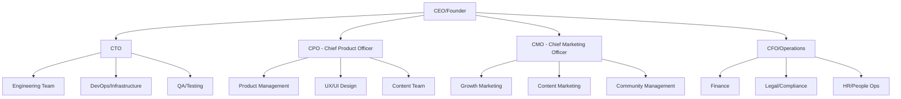

# Team Structure & Organization — Bank Soal + Buku Digital Bahasa Inggris
**Tanggal:** 31 Agustus 2025  
**Tim:** People & Organization  
**Status:** Implementation Ready

---

## 1. Organizational Structure Overview

### 1.1 Company Structure
**Organizational Hierarchy:**


### 1.2 Team Size Evolution
**Hiring Roadmap by Phase:**
```json
{
  "mvp_phase": {
    "duration": "3 months",
    "team_size": 12,
    "focus": "Core product development and launch"
  },
  "growth_phase": {
    "duration": "6 months", 
    "team_size": 25,
    "focus": "User acquisition and product optimization"
  },
  "scale_phase": {
    "duration": "12 months",
    "team_size": 45,
    "focus": "Market expansion and advanced features"
  }
}
```

---

## 2. Core Team Composition

### 2.1 Engineering Team
**Team Structure:**
```yaml
engineering_team:
  tech_lead:
    role: "Technical Leadership & Architecture"
    experience: "8+ years, startup experience preferred"
    skills: ["Python", "React", "System Design", "Team Leadership"]
    salary_range: "Rp 600-800M/year"
    
  senior_backend_developers:
    count: 2
    role: "API development, database design, performance optimization"
    experience: "5+ years Python/FastAPI"
    skills: ["FastAPI", "PostgreSQL", "Redis", "AWS/GCP"]
    salary_range: "Rp 400-550M/year"
    
  senior_frontend_developers:
    count: 2
    role: "Web and mobile app development"
    experience: "5+ years React/Next.js"
    skills: ["React", "Next.js", "TypeScript", "Mobile-first design"]
    salary_range: "Rp 380-520M/year"
    
  full_stack_developers:
    count: 2
    role: "Feature development across stack"
    experience: "3+ years full-stack"
    skills: ["Python", "React", "Database design", "API integration"]
    salary_range: "Rp 300-420M/year"
    
  devops_engineer:
    count: 1
    role: "Infrastructure, CI/CD, monitoring"
    experience: "4+ years DevOps/SRE"
    skills: ["Kubernetes", "Terraform", "AWS/GCP", "Monitoring"]
    salary_range: "Rp 450-600M/year"
```

### 2.2 Product Team
**Product Organization:**
```yaml
product_team:
  product_manager:
    role: "Product strategy, roadmap, user research"
    experience: "5+ years product management, EdTech preferred"
    skills: ["Product Strategy", "User Research", "Analytics", "A/B Testing"]
    salary_range: "Rp 500-700M/year"
    
  ux_ui_designer:
    role: "User experience and interface design"
    experience: "4+ years UX/UI design"
    skills: ["Figma", "User Research", "Mobile Design", "Design Systems"]
    salary_range: "Rp 350-480M/year"
    
  content_strategist:
    role: "Curriculum design and content strategy"
    experience: "5+ years educational content, English teaching"
    skills: ["Curriculum Design", "English Pedagogy", "Content Creation"]
    salary_range: "Rp 300-420M/year"
    
  data_analyst:
    role: "Product analytics and user behavior analysis"
    experience: "3+ years data analysis"
    skills: ["SQL", "Python", "Tableau/Looker", "Statistical Analysis"]
    salary_range: "Rp 280-380M/year"
```

### 2.3 Content Team
**Content Creation & Quality:**
```yaml
content_team:
  content_authors:
    count: 2
    roles:
      - native_english_speaker: "Grammar accuracy, natural language usage"
      - indonesian_educator: "Local context, common errors, cultural relevance"
    experience: "3+ years educational content creation"
    skills: ["English Teaching", "Curriculum Development", "Content Writing"]
    salary_range: "Rp 200-300M/year"
    
  content_reviewer:
    role: "Quality assurance, editorial oversight"
    experience: "5+ years editorial/educational content"
    skills: ["Content Review", "Quality Assurance", "Educational Standards"]
    salary_range: "Rp 250-350M/year"
    
  qa_specialist:
    role: "Content testing, user acceptance testing"
    experience: "3+ years QA, educational content preferred"
    skills: ["Manual Testing", "Content Validation", "User Testing"]
    salary_range: "Rp 180-250M/year"
```

### 2.4 Growth & Marketing Team
**User Acquisition & Retention:**
```yaml
marketing_team:
  growth_manager:
    role: "Growth strategy, user acquisition, conversion optimization"
    experience: "5+ years growth marketing, B2C preferred"
    skills: ["Growth Hacking", "Performance Marketing", "Analytics", "A/B Testing"]
    salary_range: "Rp 450-650M/year"
    
  digital_marketing_specialist:
    role: "Paid advertising, SEM, social media advertising"
    experience: "3+ years digital marketing"
    skills: ["Google Ads", "Facebook Ads", "Analytics", "Conversion Optimization"]
    salary_range: "Rp 250-350M/year"
    
  content_marketing_manager:
    role: "Blog content, SEO, educational content marketing"
    experience: "4+ years content marketing"
    skills: ["Content Strategy", "SEO", "Blog Writing", "Social Media"]
    salary_range: "Rp 280-380M/year"
    
  community_manager:
    role: "User community, social media, customer support"
    experience: "2+ years community management"
    skills: ["Community Building", "Social Media", "Customer Support", "Engagement"]
    salary_range: "Rp 150-220M/year"
```

---

## 3. Hiring Strategy & Timeline

### 3.1 Recruitment Phases
**Phase 1: Core Team (Month 1-2)**
```markdown
### Priority Hires
**Week 1-2:**
- Tech Lead (critical for architecture decisions)
- Product Manager (product strategy and user research)
- Senior Backend Developer (API development)

**Week 3-4:**
- Senior Frontend Developer (user interface)
- Content Strategist (curriculum design)
- UX/UI Designer (user experience)

**Week 5-8:**
- Additional developers based on workload
- Content authors and reviewer
- DevOps engineer for infrastructure
```

**Phase 2: Growth Team (Month 3-4)**
```markdown
### Scaling Hires
**Month 3:**
- Growth Manager (user acquisition strategy)
- Data Analyst (product analytics)
- QA Specialist (quality assurance)

**Month 4:**
- Digital Marketing Specialist (paid acquisition)
- Content Marketing Manager (organic growth)
- Community Manager (user engagement)
```

### 3.2 Recruitment Channels
**Talent Acquisition Strategy:**
```json
{
  "recruitment_channels": {
    "tech_roles": {
      "primary": ["LinkedIn", "AngelList", "Tech in Asia Jobs"],
      "secondary": ["GitHub", "Stack Overflow Jobs", "Referrals"],
      "success_rate": "15-20% application to hire"
    },
    "product_roles": {
      "primary": ["LinkedIn", "ProductHunt Jobs", "Referrals"],
      "secondary": ["AngelList", "Remote job boards"],
      "success_rate": "10-15% application to hire"
    },
    "content_roles": {
      "primary": ["Education job boards", "LinkedIn", "Referrals"],
      "secondary": ["Freelancer networks", "Teaching communities"],
      "success_rate": "20-25% application to hire"
    },
    "marketing_roles": {
      "primary": ["LinkedIn", "Marketing job boards", "Referrals"],
      "secondary": ["Growth communities", "Startup job boards"],
      "success_rate": "12-18% application to hire"
    }
  }
}
```

### 3.3 Interview Process
**Standardized Hiring Process:**
```python
class InterviewProcess:
    def __init__(self):
        self.process_stages = {
            'application_review': {
                'duration': '2-3 days',
                'criteria': ['Experience match', 'Portfolio quality', 'Cultural fit indicators']
            },
            'phone_screening': {
                'duration': '30 minutes',
                'focus': ['Basic qualifications', 'Salary expectations', 'Availability']
            },
            'technical_assessment': {
                'duration': '1-2 hours',
                'format': 'Role-specific (coding, design, case study)',
                'evaluation': 'Skills demonstration and problem-solving'
            },
            'team_interview': {
                'duration': '45-60 minutes',
                'participants': ['Hiring manager', 'Team members', 'Cross-functional stakeholder'],
                'focus': ['Technical depth', 'Team collaboration', 'Cultural fit']
            },
            'final_interview': {
                'duration': '30 minutes',
                'participants': ['Department head or founder'],
                'focus': ['Vision alignment', 'Leadership potential', 'Final questions']
            }
        }
    
    def evaluate_candidate(self, role, interview_results):
        scoring_criteria = {
            'technical_skills': 0.4,
            'problem_solving': 0.25,
            'communication': 0.15,
            'cultural_fit': 0.15,
            'growth_potential': 0.05
        }
        
        total_score = sum(
            interview_results[criteria] * weight 
            for criteria, weight in scoring_criteria.items()
        )
        
        return {
            'total_score': total_score,
            'recommendation': 'hire' if total_score >= 7.5 else 'no_hire',
            'feedback': self.generate_feedback(interview_results)
        }
```

---

## 4. Compensation & Benefits

### 4.1 Compensation Philosophy
**Total Compensation Framework:**
```yaml
compensation_philosophy:
  market_positioning: "75th percentile of Indonesian tech market"
  equity_participation: "All employees receive equity"
  performance_based: "Annual performance bonuses"
  transparency: "Salary bands published internally"
  
salary_structure:
  base_salary:
    percentage: 70
    philosophy: "Competitive base for financial security"
  
  performance_bonus:
    percentage: 15
    criteria: ["Individual performance", "Company goals achievement"]
  
  equity_compensation:
    percentage: 15
    vesting: "4 years with 1-year cliff"
    
benefits_package:
  health_insurance:
    coverage: "Employee + family"
    provider: "Premium health insurance"
  
  professional_development:
    budget: "Rp 10M per employee per year"
    includes: ["Conferences", "Courses", "Books", "Certifications"]
  
  flexible_work:
    policy: "Hybrid work model"
    remote_days: "Up to 3 days per week"
  
  time_off:
    annual_leave: "25 days"
    sick_leave: "12 days"
    personal_days: "5 days"
```

### 4.2 Equity Distribution
**Employee Stock Option Plan (ESOP):**
```json
{
  "equity_pool": "15% of company equity reserved for employees",
  "allocation_by_level": {
    "c_level": "1.0-2.5%",
    "senior_management": "0.5-1.0%", 
    "senior_individual_contributors": "0.2-0.5%",
    "mid_level": "0.1-0.3%",
    "junior_level": "0.05-0.15%"
  },
  "vesting_schedule": {
    "duration": "4 years",
    "cliff": "1 year",
    "acceleration": "Double trigger for acquisition"
  }
}
```

---

## 5. Team Culture & Values

### 5.1 Core Values
**Cultural Foundation:**
```markdown
### Company Values
**1. Learning-First Mindset**
- Continuous learning and improvement
- Embrace failure as learning opportunity
- Share knowledge openly within team

**2. User-Centric Approach**
- Every decision considers user impact
- Data-driven product development
- Empathy for Indonesian English learners

**3. Quality & Excellence**
- High standards for code and content
- Thorough testing and review processes
- Pride in craftsmanship

**4. Collaboration & Transparency**
- Open communication across teams
- Shared goals and collective success
- Regular feedback and recognition

**5. Innovation & Agility**
- Embrace new technologies and methods
- Quick iteration and adaptation
- Creative problem-solving
```

### 5.2 Team Rituals & Practices
**Regular Team Activities:**
```yaml
daily_practices:
  standup_meetings:
    frequency: "Daily, 15 minutes"
    format: "What did you do yesterday? What will you do today? Any blockers?"
    participants: "Team leads + individual contributors"
  
  code_reviews:
    requirement: "All code must be reviewed by at least one peer"
    tools: "GitHub pull requests with required approvals"
    
weekly_practices:
  team_retrospectives:
    frequency: "Weekly, 30 minutes per team"
    format: "What went well? What could improve? Action items?"
  
  all_hands_meeting:
    frequency: "Weekly, 30 minutes"
    content: "Company updates, metrics, team highlights"
    
  demo_sessions:
    frequency: "Weekly, 45 minutes"
    content: "Teams demo completed features and progress"

monthly_practices:
  one_on_ones:
    frequency: "Monthly, 30 minutes"
    participants: "Manager + direct report"
    focus: "Career development, feedback, goal setting"
  
  team_building:
    frequency: "Monthly"
    activities: ["Team lunch", "Game sessions", "Learning workshops"]
  
  company_metrics_review:
    frequency: "Monthly"
    content: "Business metrics, user feedback, team performance"
```

### 5.3 Performance Management
**Performance Review System:**
```python
class PerformanceManagement:
    def __init__(self):
        self.review_cycle = {
            'frequency': 'quarterly',
            'components': [
                'goal_achievement',
                'technical_skills',
                'collaboration',
                'cultural_values',
                'growth_mindset'
            ]
        }
        
        self.career_levels = {
            'junior': {
                'focus': 'Learning and skill development',
                'expectations': 'Complete assigned tasks with guidance',
                'growth_path': 'Mid-level in 12-18 months'
            },
            'mid_level': {
                'focus': 'Independent contribution and mentoring',
                'expectations': 'Own features end-to-end, help junior members',
                'growth_path': 'Senior level in 18-24 months'
            },
            'senior': {
                'focus': 'Technical leadership and system design',
                'expectations': 'Lead complex projects, mentor team members',
                'growth_path': 'Staff/Principal or management track'
            }
        }
    
    def conduct_performance_review(self, employee, period):
        review_data = {
            'self_assessment': employee.complete_self_assessment(),
            'peer_feedback': self.collect_peer_feedback(employee),
            'manager_evaluation': employee.manager.evaluate(employee),
            'goal_progress': self.assess_goal_progress(employee, period)
        }
        
        overall_rating = self.calculate_performance_rating(review_data)
        development_plan = self.create_development_plan(employee, review_data)
        
        return {
            'rating': overall_rating,
            'development_plan': development_plan,
            'promotion_readiness': self.assess_promotion_readiness(employee),
            'compensation_adjustment': self.recommend_compensation_change(overall_rating)
        }
```

---

## 6. Knowledge Management & Documentation

### 6.1 Documentation Strategy
**Knowledge Repository:**
```yaml
documentation_structure:
  technical_docs:
    location: "Confluence + GitHub Wiki"
    content:
      - "API documentation"
      - "Architecture decisions (ADRs)"
      - "Deployment procedures"
      - "Troubleshooting guides"
    
  product_docs:
    location: "Notion"
    content:
      - "Product requirements documents"
      - "User research findings"
      - "Feature specifications"
      - "Design system documentation"
    
  process_docs:
    location: "Notion"
    content:
      - "Team processes and workflows"
      - "Meeting templates and agendas"
      - "Onboarding checklists"
      - "Emergency procedures"
    
  content_guidelines:
    location: "Notion + Google Docs"
    content:
      - "Content style guide"
      - "Quality standards"
      - "Review processes"
      - "Curriculum standards"
```

### 6.2 Knowledge Sharing Practices
**Learning & Development:**
```markdown
### Knowledge Sharing Activities
**Tech Talks (Bi-weekly):**
- Team members present on new technologies
- External speakers on industry trends
- Case studies from other companies

**Code Review Sessions:**
- Weekly group code review for learning
- Best practices sharing
- Architecture discussions

**Documentation Days:**
- Monthly dedicated time for documentation
- Update outdated docs
- Create missing documentation

**Cross-team Shadowing:**
- Engineers shadow product/design sessions
- Product team joins engineering planning
- Content team participates in user research
```

---

## 7. Remote Work & Collaboration

### 7.1 Hybrid Work Model
**Flexible Work Policy:**
```json
{
  "work_arrangement": {
    "office_days": "2-3 days per week (Tuesday, Wednesday, Thursday)",
    "remote_days": "2-3 days per week (Monday, Friday flexible)",
    "core_hours": "10:00 AM - 3:00 PM WIB (overlap time)",
    "flexibility": "Adjust based on project needs and personal preferences"
  },
  "collaboration_tools": {
    "communication": ["Slack", "Google Meet", "WhatsApp for urgent"],
    "project_management": ["Linear", "Notion", "GitHub Projects"],
    "design_collaboration": ["Figma", "Miro", "Loom for async feedback"],
    "documentation": ["Notion", "Confluence", "Google Workspace"]
  }
}
```

### 7.2 Remote Collaboration Best Practices
**Effective Remote Work:**
```python
class RemoteCollaboration:
    def __init__(self):
        self.best_practices = {
            'communication': [
                'Default to async communication',
                'Use video calls for complex discussions',
                'Document decisions in shared spaces',
                'Respect time zones and working hours'
            ],
            'meetings': [
                'Always have agenda and objectives',
                'Record important meetings for async viewing',
                'Use collaborative tools during meetings',
                'Follow up with written summaries'
            ],
            'project_management': [
                'Clear task descriptions and acceptance criteria',
                'Regular progress updates in shared channels',
                'Visual project tracking with dashboards',
                'Defined handoff processes between team members'
            ]
        }
    
    def optimize_remote_productivity(self):
        strategies = {
            'focus_time': 'Block calendar for deep work',
            'communication_windows': 'Designated times for quick questions',
            'documentation_first': 'Write before speaking when possible',
            'regular_check_ins': 'Structured 1:1s and team syncs'
        }
        return strategies
```

---

## 8. Onboarding & Training

### 8.1 New Employee Onboarding
**30-60-90 Day Plan:**
```markdown
### Onboarding Timeline
**First Week:**
- Company overview and culture introduction
- Team introductions and role expectations
- Development environment setup
- First small task completion

**First Month:**
- Complete first meaningful project
- Shadow experienced team members
- Attend all team meetings and ceremonies
- Begin contributing to team discussions

**First Quarter:**
- Own a feature or project component
- Provide feedback on onboarding process
- Set performance goals with manager
- Begin mentoring newer team members (if applicable)
```

### 8.2 Continuous Learning Program
**Professional Development:**
```yaml
learning_opportunities:
  internal_training:
    frequency: "Monthly workshops"
    topics: ["Technical skills", "Product knowledge", "Soft skills"]
    format: "Hands-on workshops and presentations"
  
  external_learning:
    budget: "Rp 10M per employee per year"
    options: ["Online courses", "Conferences", "Certifications", "Books"]
    approval: "Manager approval required for >Rp 2M expenses"
  
  mentorship_program:
    structure: "Senior employees mentor junior members"
    commitment: "1 hour per week minimum"
    goals: ["Skill development", "Career guidance", "Knowledge transfer"]
  
  conference_attendance:
    policy: "1-2 conferences per year per employee"
    sharing: "Present learnings to team upon return"
    budget: "Included in professional development budget"
```

---

## 9. Success Metrics & Team Health

### 9.1 Team Performance Metrics
**Key Performance Indicators:**
```json
{
  "productivity_metrics": {
    "velocity": "Story points completed per sprint",
    "cycle_time": "Time from development start to production",
    "deployment_frequency": "Number of deployments per week",
    "lead_time": "Time from idea to user value delivery"
  },
  "quality_metrics": {
    "bug_rate": "Bugs per feature delivered",
    "code_coverage": "Percentage of code covered by tests",
    "customer_satisfaction": "User feedback and NPS scores",
    "technical_debt": "Time spent on maintenance vs new features"
  },
  "team_health_metrics": {
    "employee_satisfaction": "Quarterly team satisfaction surveys",
    "retention_rate": "Annual employee turnover rate",
    "internal_promotion_rate": "Percentage of roles filled internally",
    "learning_participation": "Training and development engagement"
  }
}
```

### 9.2 Team Health Monitoring
**Regular Health Checks:**
```python
class TeamHealthMonitoring:
    def __init__(self):
        self.health_indicators = {
            'engagement': {
                'metrics': ['Meeting participation', 'Code review activity', 'Initiative taking'],
                'frequency': 'Weekly observation'
            },
            'workload': {
                'metrics': ['Hours worked', 'Overtime frequency', 'Stress indicators'],
                'frequency': 'Daily monitoring'
            },
            'collaboration': {
                'metrics': ['Cross-team projects', 'Knowledge sharing', 'Conflict resolution'],
                'frequency': 'Monthly assessment'
            },
            'growth': {
                'metrics': ['Skill development', 'Career progression', 'Learning goals'],
                'frequency': 'Quarterly review'
            }
        }
    
    def assess_team_health(self, team):
        health_score = {}
        for indicator, config in self.health_indicators.items():
            score = self.calculate_health_score(team, indicator, config)
            health_score[indicator] = score
        
        overall_health = sum(health_score.values()) / len(health_score)
        recommendations = self.generate_improvement_recommendations(health_score)
        
        return {
            'overall_health': overall_health,
            'detailed_scores': health_score,
            'recommendations': recommendations,
            'action_items': self.create_action_items(recommendations)
        }
```

This comprehensive team structure and organization framework provides a solid foundation for building and scaling a high-performing team capable of delivering the English learning platform successfully.